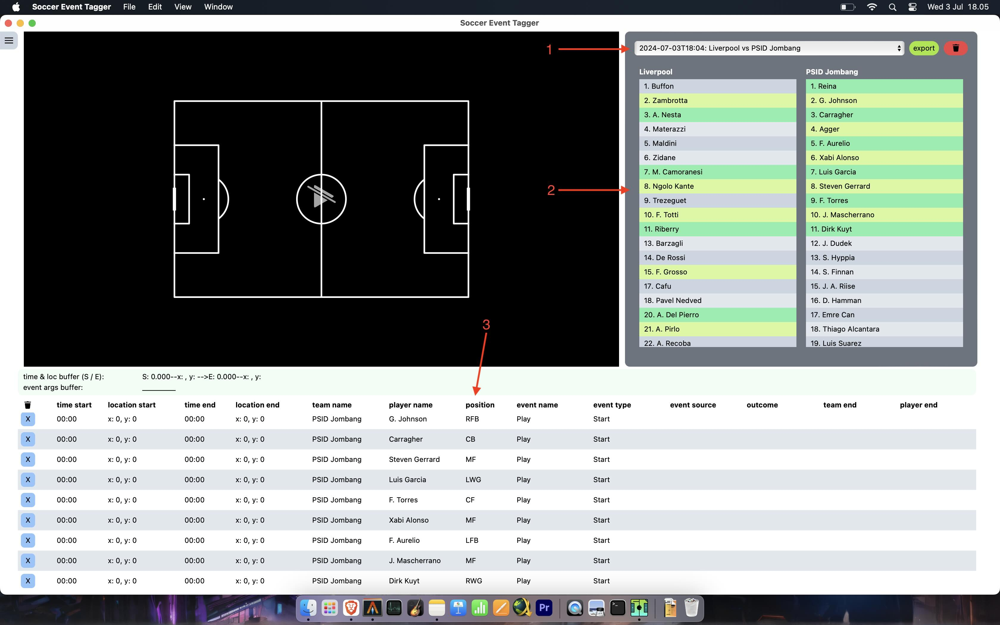

# Soccer Event Tagger

An app to tag football event data. Latest release check [here](https://github.com/qoidnaufal/soccer_event_tagger/releases/latest/).

## User Manual

### Register match info

After opening the app, first thing you wanna do is to register match info. Click menu button  on the upper left, select `Register Match Info`.
You will see this on the screen:

1. Pick `date and time` of the match
2. Insert the `team name`, both home and away
3. Insert the `list of the players`, both home and away. The rule is as follow:
  * [`number`][`)`][`player name`][`/position`] if the player is registered as starting xi. The currently available positions to register are: gk, rfb, lfb, cb, mf, rwg, lwg, cf
  * If the player is not registered as starting xi, just ommit [`/position`]
  * Each player must be separated by comma (`,`)
  * For example: `7) Marselino Ferdinan /mf` means Marselino will be registered as starting xi in which he started as a Midfielder
4. Click `submit`
5. On successfuly submitting match register, you will see the response below the submit button, and then you can go back to home screen by clicking menu and select `Home`

### Back to home screen

1. Select the `team sheet` that you have registered
2. The list of the registered players will appear below the selection, green-colored line means the player is playing
3. The players  with `/position` will be automatically registered as `events` with event name: `Play`, event type: `Start`. I designed this way to make it easier later when working with the data (eg: calculating minutes played, etc.)

### Tagging the events

Before you start tagging the events, click on the menu and select `Open Video`. The currently supported video format is *.mp4 only.
You can play / pause the video by pressing `space` on your keyboard. You can also navigate forward / backward per 1 secs by pressing `ArrowRight` or `ArrowLeft` on your keyboard, or gradually per frame by pressing `ArrowUp` or `ArrowDown`.
You can also speed up the video by pressing `Ctrl =` (additively increase speed by 0.25x), `Ctrl 2` or `Ctrl 3` (directly increase speed by the respective number), reduce the playback speed by pressing `Ctrl -` (additively reduce speed by 0.25x), or return to normal speed by pressing `Ctrl 1`.

1. At the start of the event, pause the video, click anywhere on the football pitch where the start of an event occured.
2. Your click will record the `x_start` & `y_start` coordinate of the pitch. Press `Shift S` on your keyboard to register it as the location of the start of an event. Keep in mind, when you press `Shift S` this will also register the time of the video as `time_start`. And then you can resume the video again until the end of the event reached.

1. At the end of the event, pause the video and click the location on the pitch again
2. Press `Shift E` to register the `x_end` & `y_end` and also the `time_end` of the event
3. Type the command to querry the type of event you want to register. The format is like so:
  * [`team state`][`player number`][`/`][`event`]
  * `team state` => is either `h` = Home or `a` = Away. This will directly query the team name you registered earlier. For example if you registered PSID Jombang as `team away`, when you type `a` it will show PSID Jombang
  * `player number` => is the number of the player you registered corresponding to the team_state
  * `event` => you can check this on the `menu` and select `Shortcuts Info`

There are a lot of shortcuts you can use. But basically, the shortcut itself should be pretty intuitive, like `ps` stands for `pass success`, `dgl` stands for `duel ground lose`, etc.
You can also use the search bar to filter out the commands.

Some events can be classified as "long event" in which they started somehere and end up somewhere else within a certain time span, eg: passes, shots and dribbles.
These type of events need to be registered with the `starting time` & `starting location` of the event, and the `end time` & `end location` of the event.
To register the end location of the event, pick the coordinate and press `Shift E`.
Make sure you register the end of the event on the correct video time.

There are also some other events which can be classified as "instant event", eg: aerial duel, foul, etc.
With these type of events, you just need to register the start of the event.

Some events also occured as "displacement of the ball", in which there is another player at the end of the event, eg: pass (another player either receive the ball or intercept it).
You need to add additional arguments with this format: [`/`][`team state`][`player number`]. Substitution event also need to be registered with the same format to account for the player.
In the case of an event which a diplacement of the ball occured but the ball goes out of play, you don't need to register the additional command.

Example:

`a4/daw`
* player no.`[4]` from team `[a]`way, event name: `[d]`uel, event type: `[a]`erial, outcome: `[w]`on

`h8/fkpi/a6`
* player no.`[8]` from team `[h]`ome, event name: `[p]`ass, event type: `[f]`ree `[k]`ick, outcome: `[i]ntercepted`, interceptor: player no.`[6]` from team `[a]`way

By chaining the event_start and the event_end like this, you won't need to do another clicking & typing to record the next event, which i suppose is quite inefficient.
This design also make it easier later when processing the data. For example, within the registered pass event, there is already the registered pass receiver or pass interceptor. Cool, right?

Everytime you register an event, one or two dots will be spawned on the screen to indicate the latest location(s) of the event you registered.
Hopefuly this will make it easier to navigate the pitch, and subsequently make you do the tagging faster.

Clicking on the row of the table will navigate to the minute of the start of the selected event, and of the dot(s) where the event occured will also be spawned.
If you click right on top of the `end time` cell, you will be navigated to the end time of the selected event.
You can also delete each individual row by clicking `x` button on the left most of the row.

If you click  button on the left-most cell of the table header row, all the registered events will be deleted.
But this will mess up the registered starting xi too. I suggest you to use the  button next to team sheet selection.
This button will also delete the selected team sheet.

### Export the data

You can either use the `export` button near the team sheet selection.

Or, go to menu, select `Data Dashboard` which will give you more options.
Whether deleting or exporting per match, or all your data.
For now, only *.csv is available.

I also suggest to periodically clean up the data (make sure you have exported them), since i haven't tested yet whether this app can be a full fledged database app.
Although i bet it will be just fine :)

## TODO:
There are various features which i think i need to add, but pretty much the skeleton of the app is pretty stable. In the upcoming version, i will try to add these:
  * prevent auto video resizing [done]
  * stabilize window size accross different platform [done]
  * caching video src [done]
  * data dashboard [done]
  * switch to file based db [done]
  * move some heavy-parsing on the front-end to the back-end
  * video clipping and exporting (perhaps this is included in db management page, idk)
  * show latest tagged event as dot on the pitch [done]
  * generate relevant dataviz (maybe, but i think this is too much)
  * user manual [done]
  * updater [done but need some investigation]
