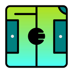

# Soccer Event Tagger

WIP

## User Manual [eng]
### Register match info
After opening the app, first thing you wanna do is to register match info. Click menu button  on the upper left, select `Register Match Info`.
You will see this on the screen:

1. Pick `date and time` of the match,
2. Insert the `team name`, both home and away,
3. Insert the `list of the players`, both home and away. The rule is as follow:
- [`number`][`)`][`player name`][`/position`] if the player is registered as starting xi. The currently available positions to register are: gk, rfb, lfb, cb, mf, rwg, lwg, cf,
- If the player is not registered as starting xi, just ommit [`/position`],
- Each player must be separated by comma (`,`),
- For example: `7) Marselino Ferdinan /mf` means Marselino will be registered as starting xi in which he started as a Midfielder,
4. Click `submit`, and back to home screen by clicking the top left button 

### Back to home screen

1. Select the `team sheet` that you have registered,
2. The list of the registered players will appear, unfortunately the list of the players is still sorted by the player's number, not by whether they start the game or not,
3. The players registered as starting xi (those who you register with `/position`). I designed this way to make it easier later when working with the data (eg: calculating minutes played, etc.),

### Tagging the events
Before you start tagging the events, click on the menu and select `Open Video`. The currently supported video format is *.mp4 only.
You can play / pause the video by pressing `space` on your keyboard. You can also navigate by pressing `right` or `left` on your keyboard. You can also speed up the video by pressing `Ctrl +` or `Ctrl 2`, reduce the playback speed by pressing `Ctrl -`, or return to normal speed by pressing `Ctrl 1`.

1. At the start of the event, pause the video, click anywhere on the football pitch where the start of an event occured. Your click will record the `x` & `y` coordinate of the pitch. Press `Shift S` on your keyboard to register it as the location of the start of an event. Keep in mind, when you press `Shift S` this will also register the time of the video.
2. To register the type of the event, type on your keyboard with the following format:
- [`team state`][`player number`][`/`][`event`],
- `team state` => is either `h` = `Home` or `a` = `Away`. This will directly query the team name you registered earlier. For example if you registered PSID Jombang as team away, when you type a it will show PSID Jombang,
- `player number` => is the number of the player you registered
- `event` => you can check this on the `menu` and select `Shortcuts Info`,
- So, typing a1/gks/a3 means:
- a1 => player number 1 from team away,
- gks => event name: pass, event type: goal kick, outcome: success,
- a3 => 

Some events occured as "long event" in which they started somehere and ended somewhere else, eg: passes, shots and dribbles. These type of events need to be registered with the starting time & starting location of the event, and the end time and end location of the event. Other events just occured as "instant event", eg: aerial duel, foul, etc. With these type of events, you just need to register the start of the event.

Some events also occured as "displacement of the ball", in which there is another player at the end of the event, eg: pass (another player either receive the ball or intercept it). You need to add additional arguments with this format: [`/`][`team state`][`player number`].

Example:
- a4/daw => player no.4 from team away, event name: duel, event type: aerial, outcome: won.
- h8/pi/a6 => player no. 8 from team home, event name: pass, event type: open play, outcome: intercepted, interceptor: player no.6 from the away

I designed this way to make it easier later when processing the data. For example, within the registered pass event, there is also the registered pass receiver or pass interceptor.

Clicking on the row of the table will navigate to the minute of the start of the selected event. You can also delete each individual row by clicking `x` button on the left most of the row. If you click  button, all the registered events will be deleted.

### Export the data
Go to menu, select `Export Data`. For now, only *.csv is available.

## TODO:
There are various features which i think i need to add, but pretty much the skeleton of the app is pretty stable. In the upcoming version, i will try to add these:
- prevent auto video resizing [done]
- stabilize window size accross different platform
- caching video src
- database management page, or
- simple button to delete registered match info
- switch to file based db
- video clipping and exporting (perhaps this is included in db management page, idk)
- show latest tagged event as dot on the pitch (maybe with arrow)
- generate relevant dataviz (maybe, but i think this is too much)
- user manual [done, see above, but i need to put this inside the app]
- updater [done but need testing]
